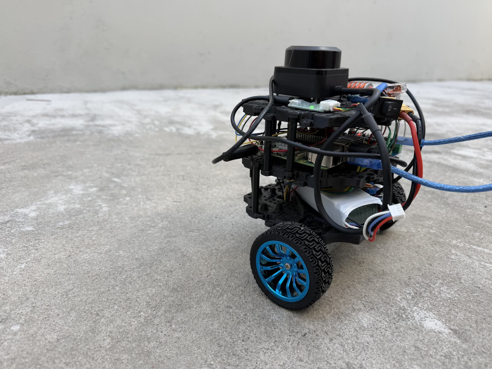
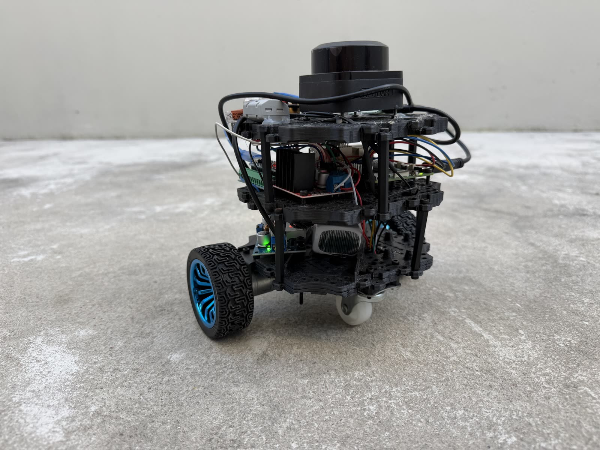
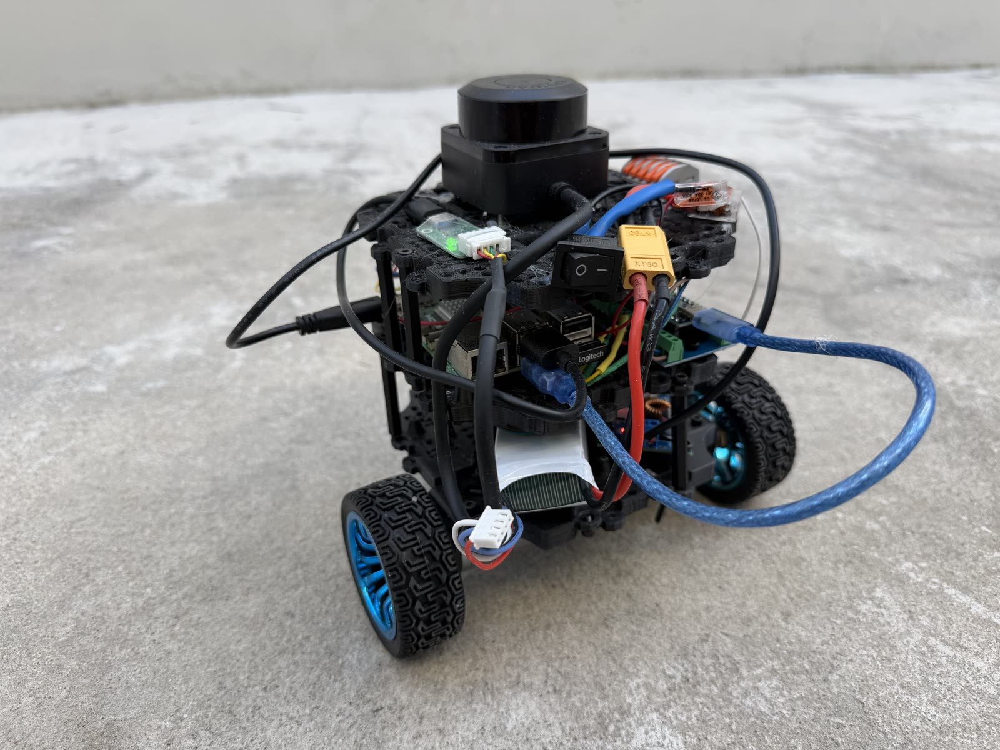
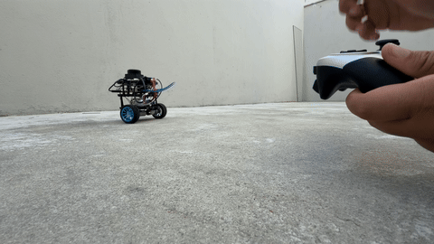

# DiffBot

An autonomous differential-drive robot built from scratch in ROS 2 — control, odometry, localization, SLAM, path planning, and navigation.

Following the base structure of Antonio Brandi's "Self-Driving and ROS 2 - Learn by Doing" reimplemented

## The Robot

<p align="center">
  
  
  
</p>

<p align="center">
  
  <br>
  <sub>Joystick teleop — full clip: <a href="media/diffbot_teleop.MOV">diffbot_teleop.MOV</a></sub>
</p>

## Roadmap

- **Phase 1 — Control & Odometry**: ROS2 basics, locomotion, control, kinematics, TF2, odometry, sensor fusion (EKF). 
- **Phase 2 — Localization & Mapping**: probability, global localization, sensors, maps, SLAM. 
- **Phase 3 — Planning & Navigation**: path/motion planning, obstacle avoidance, Nav2, decision making. 

## Structure

```
diffbot_ws/         # real ROS2 workspace (colcon) — code lives and builds here
```

## Packages

| Package | Language | Purpose |
| --- | --- | --- |
| `diffbot_description` | URDF/Xacro | 3D robot model, visual/collision geometry, joint definitions, and simulation parameters |
| `diffbot_msgs` | Interfaces | Custom msg/srv/action definitions used across DiffBot packages |
| `diffbot_controller` | Config/Launch/C++ | ros2_control controllers, the `simple_controller` differential-kinematics node, and joystick teleop |
| `diffbot_localization` | Config/Launch/C++ | Sensor fusion — `imu_republisher` re-frames `/imu/out` to `base_footprint_ekf`; `robot_localization` EKF (`ekf.yaml`) fuses it with noisy wheel odometry (`odom_noisy`) |
| `diffbot_firmware` | C++/Python/Arduino | Real hardware only — `diffbot_interface` (`hardware_interface::SystemInterface` plugin, talks to the Arduino over `LibSerial`/`/dev/ttyUSB0`), `mpu6050_driver.py` (I2C IMU driver publishing `/imu/out`), and the `robot_control`/`robot_control_inverted` Arduino sketches |
| `diffbot_bringup` | Launch | Top-level launch files — `simulated_robot.launch.py` (Gazebo + controller + joystick + EKF localization) and `real_robot.launch.py` (`diffbot_firmware` hardware interface + controller + joystick + `mpu6050_driver`) |

## Bringup

Top-level launch files (`diffbot_bringup`) that bring up the whole robot in one command:

```sh
ros2 launch diffbot_bringup simulated_robot.launch.py   # gazebo + controller + joystick + EKF localization
ros2 launch diffbot_bringup real_robot.launch.py        # diffbot_firmware + controller + joystick + mpu6050_driver
```

Both always run the full `diff_drive_controller` path; `real_robot.launch.py` has no EKF step yet.

## ros2_control

Wheel velocity control goes through `ros2_control`, configured in `diffbot_controller/config/diffbot_controllers.yaml` and picked at launch via `use_simple_controller`:

- **`simple_controller`** (default) — hand-built path: `simple_controller.cpp` converts `cmd_vel` to wheel velocities via differential-drive inverse kinematics, no odometry.
- **`diffbot_controller`** (`use_simple_controller:=False`) — built-in `diff_drive_controller`, also publishes `/odom` + TF and enforces velocity/acceleration limits.

```sh
ros2 launch diffbot_controller controller.launch.py                              # simple_controller (default)
ros2 launch diffbot_controller controller.launch.py use_simple_controller:=False  # diff_drive_controller
```

## Comparing odometry (PlotJuggler)

With Gazebo, `controller.launch.py` and `local_localization.launch.py` all running, install and open PlotJuggler:

```sh
sudo apt install -y ros-humble-plotjuggler-ros
ros2 run plotjuggler plotjuggler
```

Streaming → Start: "ROS2 Topic Subscriber", pick `/diffbot_controller/odom` (truth), `/diffbot_controller/odom_noisy` (noisy), and `/odometry/filtered` (EKF output). Plot `pose/pose/position/x` vs `.../y` from each on the same XY plot to compare trajectories visually.


## Build

```sh
cd diffbot_ws
colcon build
. install/setup.bash
```

## Battery (3S LiPo, 2.2Ah)

| | Voltage | Per cell |
| --- | --- | --- |
| Fully charged (safe) | 12.6V | 4.2V |
| Minimum charged (safe) — below this can cause permanent damage | 9V | 3.0V |
| Recommended cutoff range | 9.9V – 11.1V | 3.3V – 3.7V |
| Storage voltage | 11.4V | 3.8V |

Safe charging current: 1C × 2.2Ah = **2.2A**

## Notes

- **Gazebo inside Docker**: if `ros2 launch diffbot_description gazebo.launch.py` starts but the spawn node (`ros_gz_sim create`) loops forever on `Requesting list of world names` and the Gazebo GUI stays black/frozen, Ignition Transport is likely picking the wrong network interface for discovery (common on hosts with multiple NICs/Docker bridges). Fix by pinning discovery to loopback before launching:

  ```sh
  export GZ_IP=127.0.0.1
  export IGN_IP=127.0.0.1
  ros2 launch diffbot_description gazebo.launch.py
  ```

- **Dependencies**: declared per-package in each `package.xml`. Install them all with:

  ```sh
  rosdep update
  rosdep install --from-paths src --ignore-src -r -y
  ```
